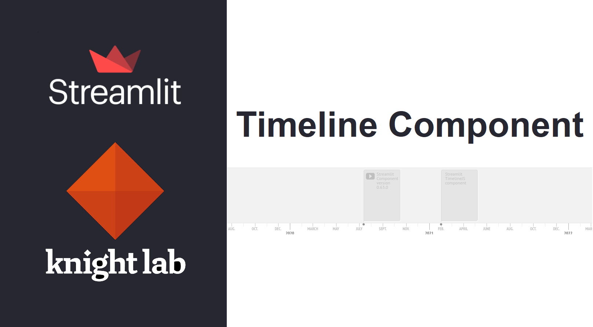
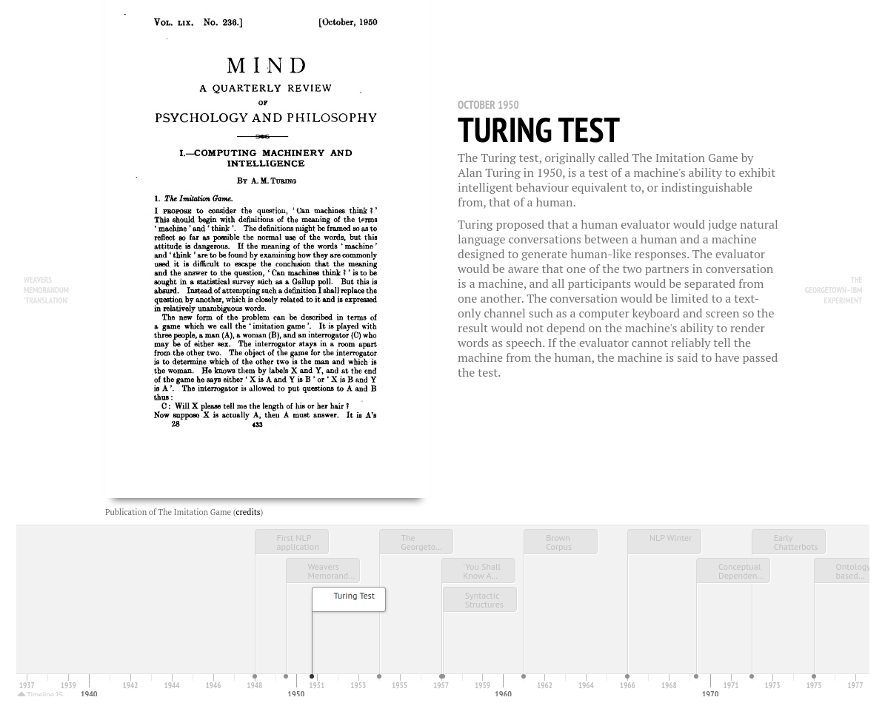

# Timeline Component for Streamlit

A simple component to display a timeline in Streamlit apps. It integrates [Knightlab's TimelineJS](https://timeline.knightlab.com).


## Installation

First install Streamlit (of course!) then pip-install this library:

```bash
pip install streamlit
pip install streamlit-timeline
```


## Example

```python
# Streamlit Timeline Component Example

import streamlit as st
from streamlit_timeline import timeline


# use full page width
st.set_page_config(page_title="Timeline Example", layout="wide")

# load data
with open('example.json', "r") as f:
    data = f.read()

# render timeline
timeline(data, height=800)
```


## Parameters

The `timeline()` function accepts a string or a dict, as long as it's in the [TimelineJS json format](https://timeline.knightlab.com/docs/json-format.html). The optional heigth of the visualization is in px.


## Preview
You can also check the [preview video](https://www.youtube.com/embed/N61ed-XvPR4) or go to the demo [A History of Natural Language Processing](https://github.com/innerdoc/nlp-history-timeline).

[](https://www.youtube.com/embed/N61ed-XvPR4)
